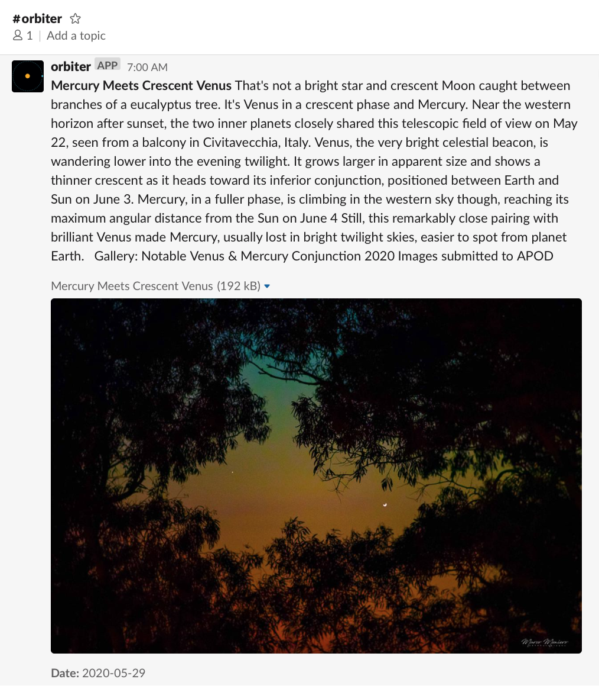

# Orbiter Slack

A Slack app that offers some of NASA's APIs directly in Slack.

## User interactions

We're going to have one single entry point for simplicity, the slash command.

```
/orbiter - returns a list of available apps
/orbiter [APP] - returns a list of actions and options for that app
```

---

Astronomy Picture of the Day

```
/orbiter apod - returns the most recent APOD
```



---
