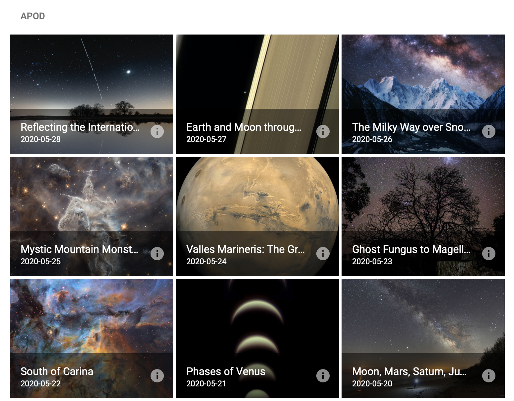

# APOD

Astronomy Picture of the Day for the last 30 days.

[Orbiter Web APOD](http://34.89.68.191)

## Stack
Built with [React hooks](https://reactjs.org/docs/hooks-overview.html), [TypeScript](https://www.typescriptlang.org), [Material-UI](https://material-ui.com)
managed by [Yarn](https://classic.yarnpkg.com/en/)
put together by [Webpack](https://webpack.js.org)
and coded in [Emacs](https://www.gnu.org/software/emacs/)

---

